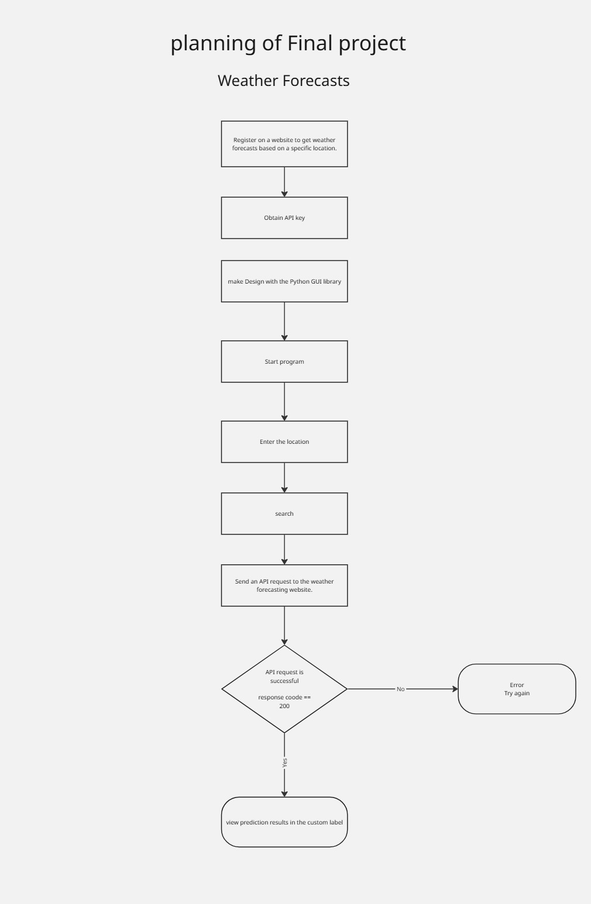

# Weather Forecast

A desktop weather application built with Python and Tkinter. The application allows users to search for a city and retrieve current weather information using the OpenWeatherMap API.

## Features

- Search weather by city name
- Display current temperature
- Display humidity
- Display wind speed
- Display atmospheric pressure
- Display precipitation probability
- Handle invalid city names
- Handle connection errors
- Handle request timeouts

## Technologies

- Python
- Tkinter
- Requests
- OpenWeatherMap API

## Interface



## How to Run

Install the required library:

```bash
pip install requests
```
Run the application:
```bash
python weather_forecast.py
```
## Project Structure
```text

weather-forecast/
├── weather_forecast.py
├── icon.png
├── planning.png
└── README.md
```
## Learning Context
This project was developed while learning Python fundamentals as part of the Front-End Diploma at Al-Madrasa.
